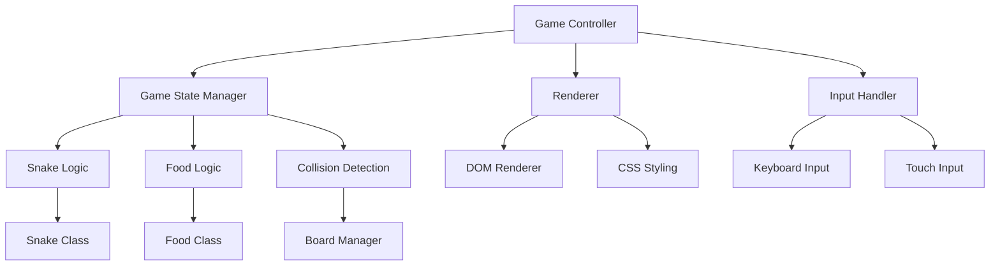
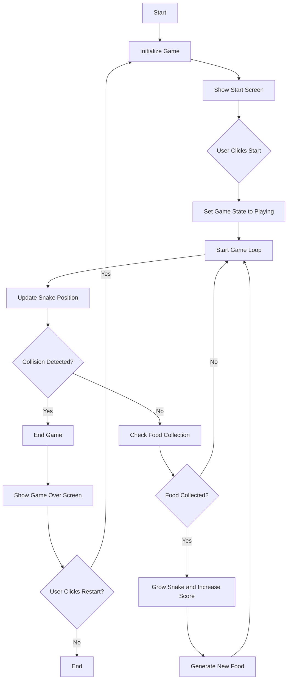

# Snake Game - Technical Specification

This document outlines the technical specification for a web-based Snake game implementation.

## 1. Game Requirements and Features

### Core Gameplay Mechanics
- **Snake Movement**: The snake moves continuously in the direction of the last input (up, down, left, right)
- **Food Collection**: When the snake's head collides with food, the snake grows by one segment
- **Growth Mechanics**: Each food collected increases the snake's length by one segment
- **Collision Detection**: 
  - Game ends when snake collides with walls
  - Game ends when snake collides with itself
  - Score increases when food is collected

### User Interface Elements
- **Game Board**: Grid-based playing area where the snake moves and collects food
- **Score Display**: Real-time display of current score
- **Game Over Screen**: Display when game ends with final score and restart option
- **Start Screen**: Initial screen with game title and start button
- **Pause/Resume Functionality**: Ability to pause and resume the game

### Controls
- **Keyboard Input**: Arrow keys for direction control (up, down, left, right)
- **Mobile Support**: Touch controls for mobile devices (swipe gestures)
- **Pause Control**: Spacebar or P key to pause/resume game

### Game States
- **Start State**: Initial state with game title and instructions
- **Playing State**: Active gameplay state
- **Paused State**: Game temporarily suspended
- **Game Over State**: End state with score and restart option

## 2. Technical Architecture

### File Structure
```
snake-game/
├── index.html          # Main HTML file
├── css/
│   └── style.css       # Styling for the game
└── js/
    ├── game.js         # Main game logic
    ├── snake.js        # Snake class and behavior
    ├── food.js         # Food generation and behavior
    └── board.js        # Game board management
```

### HTML Structure Plan
```html
<!DOCTYPE html>
<html lang="en">
<head>
    <meta charset="UTF-8">
    <meta name="viewport" content="width=device-width, initial-scale=1.0">
    <title>Snake Game</title>
    <link rel="stylesheet" href="css/style.css">
</head>
<body>
    <div class="game-container">
        <header>
            <h1>Snake Game</h1>
            <div class="score">Score: <span id="score-value">0</span></div>
        </header>
        
        <div class="game-board" id="game-board">
            <!-- Game board grid will be generated by JavaScript -->
        </div>
        
        <div class="game-controls">
            <button id="start-btn">Start Game</button>
            <button id="pause-btn">Pause</button>
        </div>
        
        <div class="game-over" id="game-over" style="display: none;">
            <h2>Game Over!</h2>
            <p>Final Score: <span id="final-score">0</span></p>
            <button id="restart-btn">Play Again</button>
        </div>
    </div>
    
    <script src="js/snake.js"></script>
    <script src="js/food.js"></script>
    <script src="js/board.js"></script>
    <script src="js/game.js"></script>
</body>
</html>
```

### CSS Styling Approach
- **Responsive Design**: Flexible layout that works on different screen sizes
- **Grid-based Layout**: Using CSS Grid for the game board
- **Visual Feedback**: Color changes for snake segments, food, and game states
- **Typography**: Clear, readable fonts for score and game messages
- **Animations**: Smooth transitions for snake movement and game state changes

### JavaScript Components and Modules
1. **Game Loop (`game.js`)**:
   - Main game controller
   - Game state management
   - Frame rate control
   - Event handling

2. **Snake Class (`snake.js`)**:
   - Snake representation as array of segments
   - Movement logic
   - Direction control
   - Growth mechanics
   - Collision detection

3. **Food Class (`food.js`)**:
   - Food generation at random positions
   - Collision detection with snake
   - Visual representation

4. **Board Module (`board.js`)**:
   - Game board rendering
   - Grid management
   - Visual updates

## 3. Game Design Specifications

### Game Board Dimensions
- **Grid Size**: 20x20 cells (400 total cells)
- **Cell Size**: 20x20 pixels (400x400 pixel playing area)
- **Visual Border**: 2-pixel border around the game board

### Snake Representation and Movement Mechanics
- **Initial Position**: Snake starts with 3 segments in the center of the board
- **Movement Speed**: Initial speed of 150ms per frame, increasing with score
- **Direction Control**: 4-direction movement (no 180-degree turns allowed)
- **Segment Representation**: Each segment is a colored square
- **Head Differentiation**: Distinct visual for snake head

### Food Generation Logic
- **Random Placement**: Food appears at random empty cell
- **Exclusion Zone**: Food never appears on snake body
- **Visual Representation**: Distinct color/shape from snake segments

### Scoring System
- **Base Points**: 10 points per food collected
- **Bonus Points**: Additional points for consecutive foods without collision
- **Speed Bonus**: Higher scores for playing at faster speeds

### Visual Design Concepts
- **Color Palette**:
  - Snake: Green (#4CAF50) with darker head (#388E3C)
  - Food: Red (#F44336)
  - Background: Light gray (#F0F0F0)
  - Grid lines: Lighter gray (#E0E0E0)
  - Text: Dark gray (#333333)

- **Fonts**: 
  - Primary: 'Arial', sans-serif for readability
  - Secondary: Monospace font for score display

- **Layout**:
  - Centered game board
  - Score display at top
  - Control buttons below game board
  - Game over screen overlay

## 4. Implementation Considerations

### Browser Compatibility
- **Modern Browsers**: Chrome, Firefox, Safari, Edge (latest versions)
- **JavaScript Features**: ES6+ features (classes, arrow functions, modules)
- **CSS Features**: CSS Grid, Flexbox, Transitions
- **Polyfills**: Consider for older browsers if needed

### Performance Optimization
- **Efficient Rendering**: Only update changed elements
- **RequestAnimationFrame**: Use for smooth game loop
- **Memory Management**: Avoid memory leaks with proper event listener cleanup
- **Collision Detection**: Optimize with spatial partitioning if needed

### Responsive Design Approach
- **Flexible Sizing**: Relative units for different screen sizes
- **Mobile Controls**: Touch event support for mobile devices
- **Orientation Handling**: Adjust layout for portrait/landscape modes
- **Touch Targets**: Adequate size for mobile touch controls

## 5. Architecture Diagram



## 6. Game Flow Diagram



## 7. Technical Requirements

### Dependencies
- None (pure HTML, CSS, JavaScript)

### APIs Used
- `requestAnimationFrame` for game loop
- `addEventListener` for input handling
- `localStorage` for high score persistence (optional)

### Testing Considerations
- Cross-browser testing
- Mobile device testing
- Performance testing at different speeds
- Edge case testing (boundaries, self-collision)

## 8. Future Enhancements

### Possible Features
- **Multiplayer Mode**: Two snakes on same board
- **Power-ups**: Special food with temporary effects
- **Different Levels**: Obstacles and varying board layouts
- **Sound Effects**: Audio feedback for game events
- **Themes**: Different visual themes for the game
- **Leaderboard**: Online high score tracking

This technical specification provides a comprehensive foundation for implementing a fully functional Snake game with room for future enhancements.
